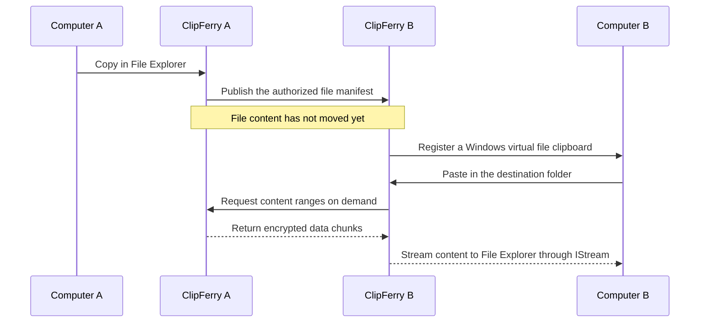

<p align="center">
  
</p>

<h1 align="center">ClipFerry</h1>

<p align="center">
  <strong>Copy on one Windows PC. Paste on the other.</strong><br>
  Lightweight, convenient, and quietly out of your way.
</p>

<p align="center">
  <strong>English</strong> · <a href="./README.zh-CN.md">简体中文</a>
</p>

<p align="center">
  <a href="#why-clipferry">Why ClipFerry</a> ·
  <a href="#quick-start">Quick start</a> ·
  <a href="#everyday-use">Everyday use</a> ·
  <a href="#security-and-privacy">Security</a> ·
  <a href="#support-the-project">Support</a>
</p>

<p align="center">
  
  
  
  
</p>

## Why ClipFerry

Using two computers should not make moving a file feel like a separate job. Keyboard and mouse movement can be handled by Microsoft PowerToys Mouse Without Borders, but its built-in file copy supports only one file at a time and has a 100 MB limit. Folders, multiple selections, and larger files still need another route.

ClipFerry focuses on that one missing piece:

1. Select files or folders in File Explorer on computer A and press `Ctrl+C`.
2. Move to computer B and press `Ctrl+V` in the destination folder.
3. ClipFerry transfers the content over the local network while File Explorer shows its normal copy progress.

There is no cloud upload, no custom file manager, and no new transfer workflow to learn.

### Lightweight

- One native Windows executable, with no bundled Electron, WebView, database, or separate runtime.
- The 0.1.4 release build is about 2.8 MiB and can run directly from any folder.
- Bounded, streaming reads avoid loading an entire large file into memory before sending it.

### Convenient

- Run it on both computers, discover the peer automatically, and confirm the first pairing on both sides.
- Keep using File Explorer and the familiar `Ctrl+C` / `Ctrl+V` workflow.
- Copy a single file, multiple files, or complete folders in either direction.
- View progress and pause, resume, or cancel a receiving transfer from the tray.

### Quiet

- Lives in the Windows notification area without taking focus or keeping a main window open.
- Copying publishes only a file manifest; file content moves only when the other computer actually pastes it.
- Can start with Windows and remain unnoticed until it is needed.

## Quick start

### 1. Prepare both computers

- Windows 10 or Windows 11, x64.
- Both computers connected to the same trusted local network. Setting that Windows network profile to **Private** is recommended.
- The same version of `clipferry.exe` on both computers.

ClipFerry handles the file clipboard. To move your keyboard and mouse between the two computers, install [Microsoft PowerToys](https://learn.microsoft.com/windows/powertoys/install) on both and enable [Mouse Without Borders](https://learn.microsoft.com/windows/powertoys/mouse-without-borders).

### 2. Set up Mouse Without Borders

1. Open PowerToys Settings on both computers and enable **Mouse Without Borders**.
2. Generate a security key on the first computer, then enter that key and the first computer's device name on the second.
3. Arrange the device tiles in PowerToys to match the physical placement of the two screens.
4. On both computers, disable **Share clipboard** and **Transfer file**. This leaves keyboard and mouse movement to Mouse Without Borders while ClipFerry remains the only program managing the Windows file clipboard.
5. If it does not connect, confirm that both machines are on the same network, check the firewall, and use **Refresh connections** as described in Microsoft's documentation.

> Mouse Without Borders is part of Microsoft PowerToys. Refer to Microsoft's documentation for its installation, permissions, security key, and connection troubleshooting.

### 3. Start ClipFerry

1. Put `clipferry.exe` on both computers. Installation and administrator privileges are not required.
2. Double-click `clipferry.exe` on both computers.
3. If Windows Firewall asks for permission on first launch, allow ClipFerry only on trusted **Private networks**.
4. Find the ClipFerry icon in the notification area. Windows may place it under the `^` hidden-icons button.

### 4. Pair once

1. Keep ClipFerry running on both computers and allow a few seconds for local discovery.
2. Right-click the tray icon on either computer and select **配对新设备…** (Pair new device).
3. Select the other computer and check its device name and address.
4. Both computers display a verification code and device fingerprint. Confirm only when the verification codes match exactly.
5. After both sides approve, ClipFerry saves the trusted device and current LAN route and enables automatic receiving.
6. Double-click the tray icon, or select **查看状态** (View status), and confirm that the peer is online.

You do not need to pair again during normal future launches.

## Everyday use

### Copy from computer A to computer B

1. In File Explorer on computer A, select one or more files or folders.
2. Press `Ctrl+C`.
3. Use Mouse Without Borders to move the keyboard and mouse to computer B.
4. Open the destination folder on computer B and press `Ctrl+V`.
5. Let File Explorer finish the copy. Keep computer A awake and connected, and keep the source files available until the transfer completes.

To copy in the other direction, repeat the same steps with the computers reversed.

### Tray menu reference

The 0.1.4 tray menu is currently displayed in Chinese:

| Menu item | Purpose |
| --- | --- |
| 查看状态 | View the local identity, trusted peer, connection, latest manifest, and transfer state |
| 配对新设备… | Discover and pair another ClipFerry computer |
| 管理已配对设备… | List trusted computers or revoke a pairing |
| 高级连接设置… | Manually select a peer and addresses for unusual network setups |
| 接收待确认的文件剪贴板 | Accept a pending manifest when automatic receiving is disabled |
| 显示传输窗口 | View file count, byte progress, speed, and current state |
| 暂停 / 继续 / 取消传输 | Pause, resume, or cancel the active receiving transfer |
| 随 Windows 启动 | Toggle startup for the current Windows user |
| 打开诊断日志 | Open the diagnostic log for discovery, connection, or transfer issues |
| 退出 ClipFerry | Stop ClipFerry cleanly |

## How it works



ClipFerry uses the Windows Shell virtual-file clipboard. The receiving side exposes `FILEGROUPDESCRIPTORW` and `FILECONTENTS` through `IDataObject`, then supplies content on demand through `IStream` when File Explorer reads it. Range-based network reads support seeks, short reads, retries, and bounded memory without first creating a full temporary copy.

## Security and privacy

- Local-network only: no cloud upload and no public relay service.
- First pairing requires matching verification codes and approval on both computers.
- Each computer has a persistent identity and SHA-256 fingerprint.
- File traffic uses mutually authenticated TLS 1.3 with certificate pinning.
- A peer can request only content explicitly authorized by the current manifest, not arbitrary local paths.
- Incoming names are validated against path traversal, UNC paths, device names, NTFS alternate data streams, and related unsafe forms.
- Pairing keys and transfer capabilities are not written to the normal diagnostic log.

Pair only computers and networks you trust. Revoke a computer from **管理已配对设备…** (Manage paired devices) when it should no longer be trusted.

## Troubleshooting

### The other computer is not discovered

Make sure ClipFerry is running on both computers, both are connected to the same LAN, and Windows Firewall allows ClipFerry on private networks. Wait a few seconds and open **配对新设备…** again.

### A paired peer is not online

Confirm that the other computer is awake and still running ClipFerry. Normal home networks refresh a discovered peer's current route automatically. For a VPN, multiple virtual adapters, or an unusual route, use **高级连接设置…** only after checking the automatic setup.

### Copying does not update the other computer's file clipboard

Open **查看状态** and verify that the active peer is online and automatic receiving is enabled. If automatic receiving is disabled, select **接收待确认的文件剪贴板**.

### PowerToys shows its own file-transfer notification

Disable **Share clipboard** and **Transfer file** in Mouse Without Borders on both computers. ClipFerry should own the file clipboard; Mouse Without Borders should handle only keyboard and mouse movement.

### Interaction with an elevated application does not work

That behavior is controlled by Mouse Without Borders, not by ClipFerry's file transfer. Microsoft documents administrator and service-mode options for interacting with elevated applications; read its security warning before enabling service mode.

## Build from source

Building requires stable Rust, the Visual Studio 2022 C++ build tools, and a Windows 10/11 SDK.

```powershell
cargo fmt --all -- --check
cargo clippy --all-targets --all-features -- -D warnings
cargo test
cargo build --release
```

The release executable is written to:

```text
target\x86_64-pc-windows-msvc\release\clipferry.exe
```

## About the author

ClipFerry is developed and maintained by **micky-meecky**. It began with a simple wish: make two useful Windows computers feel like one practical workspace without routing files through heavy remote-desktop software, screen casting, or the cloud. Mouse Without Borders solved keyboard and mouse movement well, but its file-transfer limit left a gap. ClipFerry was built as a small, native companion dedicated to moving files through the ordinary Windows clipboard.

## Support the project

If ClipFerry makes your two-computer workflow a little easier, you can support its continued development with Alipay or WeChat Pay.

<table align="center">
  <tr>
    <th align="center">Alipay</th>
    <th align="center">WeChat Pay</th>
  </tr>
  <tr>
    <td align="center"></td>
    <td align="center"></td>
  </tr>
</table>

Thank you for using, sharing, or supporting ClipFerry.

## License

ClipFerry is licensed under the [GNU General Public License v3.0](./LICENSE), identified by the SPDX expression `GPL-3.0-only`. You may use, study, modify, and redistribute it under the terms of GPLv3, including the corresponding-source and same-license requirements that apply when distributing the program or a derivative work.

---

<p align="center">
  <br>
  <sub>Copy the manifest. Paste to set sail.</sub>
</p>
