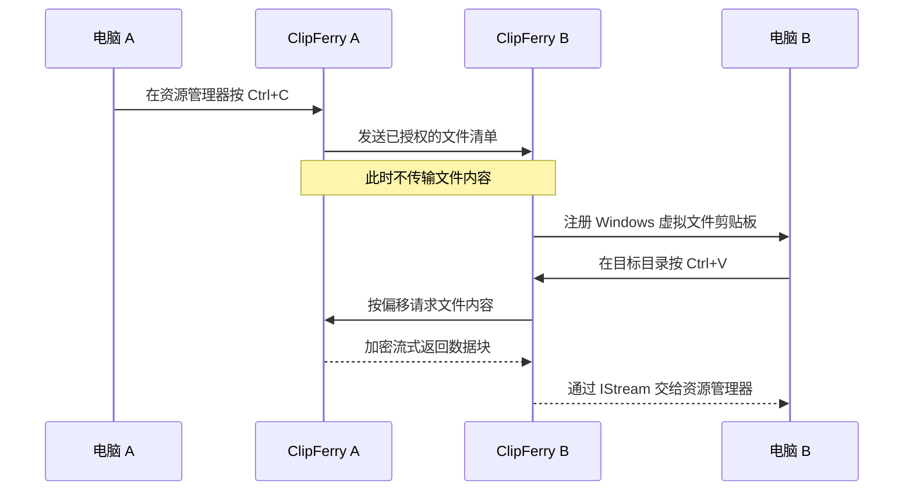

<p align="center">
  
</p>

<h1 align="center">ClipFerry</h1>

<p align="center">
  <strong>剪贴摆渡 · 在一台 Windows 电脑复制，在另一台直接粘贴。</strong><br>
  文件内容在你按下 <code>Ctrl+V</code> 时才通过局域网流式传输。
</p>

<p align="center">
  <a href="#项目简介">项目简介</a> ·
  <a href="#工作方式">工作方式</a> ·
  <a href="#当前状态">当前状态</a> ·
  <a href="#实施路线">实施路线</a> ·
  <a href="#安全边界">安全边界</a>
</p>

<p align="center">
  
  
  
  
</p>

## 项目简介

**ClipFerry（剪贴摆渡）** 是一个面向 Windows 10/11 x64 的原生局域网文件剪贴板工具。

设想中的使用方式很简单：在电脑 A 的资源管理器中选中文件并按 `Ctrl+C`，然后在电脑 B 的任意目录按 `Ctrl+V`。复制时只同步文件清单；真正粘贴时，电脑 B 才从电脑 A 按需读取文件内容。

ClipFerry 希望保留用户已经熟悉的 Windows 复制粘贴体验，不安装系统驱动，不拦截全局快捷键，也不要求用户在自定义文件管理器里完成传输。

> [!IMPORTANT]
> ClipFerry 目前处于架构设计与本地技术验证准备阶段。仓库尚无可用程序、Release 或已验证的性能数据，请勿将本文描述视为已经交付的功能。

## 工作方式



核心实现路线是 Windows Shell 虚拟文件剪贴板：B 通过 `IDataObject` 提供 `FILEGROUPDESCRIPTORW` 和 `FILECONTENTS`，每个文件内容由 `IStream` 按需读取。网络层采用范围读取，以支持资源管理器可能出现的 Seek、重试、乱序或重复请求。

## 设计原则

- **粘贴才传输**：`Ctrl+C` 阶段不预读或上传完整文件。
- **原生粘贴语义**：不全局拦截 `Ctrl+V`，不猜测资源管理器目标目录。
- **轻量常驻**：以原生 Win32/COM 和 Rust 为首选，不引入 Electron、WebView 或数据库。
- **取消优先**：取消是 MVP 必备能力；暂停/继续只有通过 Explorer 兼容性实测后才正式提供。
- **默认安全**：真实双机文件测试前必须具备认证和加密，远端只能读取本次清单明确授权的文件。
- **诚实验证**：所有兼容性、资源占用和传输结果均以真实 Windows Explorer 和双机测试为准。

## 当前状态

当前公开仓库只有项目说明、许可证和品牌资产，尚未创建 Rust 工程，也没有可执行文件。

| 项目 | 状态 |
| --- | --- |
| Windows 虚拟文件粘贴 | 未验证 |
| `IStream` 按需读取 | 未验证 |
| 暂停、继续与取消 | 未验证 |
| 双机加密传输 | 未实现 |
| Windows 10/11 兼容性 | 未验证 |
| 空闲 CPU、内存和 EXE 体积目标 | 未验证 |

首个技术验证目标是让一个并不存在于磁盘上的 `RemoteClipboard-Test.txt` 出现在 Windows 剪贴板中，并由资源管理器正确粘贴出来。

## 实施路线

- [ ] 检查 Rust、MSVC 和 Windows SDK 环境。
- [ ] 完成本地虚拟文件剪贴板与 Explorer 生命周期验证。
- [ ] 验证取消，以及短暂停、长暂停对 Explorer 的影响。
- [ ] 完成本机 TCP 回环、Seek、短读、大文件和有界内存测试。
- [ ] 捕获本机 `CF_HDROP` 并以稳定文件句柄读取真实单文件。
- [ ] 建立 TLS 1.3 安全通道并完成双机单文件 MVP。
- [ ] 完成持久配对、设备授权、重放防护和完整性方案。
- [ ] 支持多文件、文件夹、重名、断线恢复、托盘和自启动。
- [ ] 完成 Windows 10/11 双机 Release 验收。

每个阶段都必须留下可复现命令、日志和实际资源管理器结果。失败时先定位 Shell/COM、协议或文件系统根因，不用绕开原生粘贴语义的方式掩盖问题。

## 暂停与取消

传输状态计划采用：

```text
准备 → 传输中 ⇄ 已暂停 → 已完成 / 已取消 / 失败
```

取消必须能唤醒所有等待中的读取、停止新范围请求、关闭数据连接并释放源文件句柄。暂停则会在数据块边界停止新请求，并保留每个流的当前位置。

Windows Explorer 是否允许同一次虚拟文件粘贴长时间阻塞后继续，目前尚未验证。因此首版可以只承诺取消；暂停按钮只有在 5 秒、60 秒和 10 分钟兼容性测试均通过后才会启用。

## 安全边界

- 真实文件不会通过未认证、未加密的局域网连接传输。
- Offer 和 Transfer 必须绑定目标设备、有效期和高熵能力标识。
- 对端只能提交 `file_id`，不能请求任意本地路径。
- B 会独立验证远端文件名，拒绝路径穿越、UNC、设备名和 NTFS ADS 等危险形式。
- A 通过同一已验证文件句柄提供内容，避免一次传输混合不同文件版本。
- EFS、重解析点、MOTW/ADS 和云占位符在得到明确安全策略前不会被静默当作普通文件处理。
- 配对、密钥和 Transfer capability 不写入普通日志。

## 目标与非目标

| 首版目标 | 明确不做 |
| --- | --- |
| Windows 10/11 x64 | 鼠标键盘共享 |
| 同一局域网双机文件剪贴板 | 远程桌面或屏幕投送 |
| 粘贴触发的流式传输 | 云端存储与公网中转 |
| 普通文件，后续扩展文件夹 | 系统驱动或 Shell 扩展 |
| 无管理员权限运行 | 全局快捷键钩子 |
| 一个原生轻量 EXE | Electron 或完整 .NET 自包含运行时 |

## 构建与安装

尚未建立源码工程，因此目前没有有效的构建、安装或运行命令。第一阶段完成环境检查并创建最小 Rust 工程后，本节会更新为经过实际执行的命令。

## 许可证

ClipFerry 使用 [GNU General Public License v3.0](./LICENSE)，对应 SPDX 标识 `GPL-3.0-only`。你可以使用、研究、修改和分发本项目；分发本项目或其衍生版本时，需要按照 GPLv3 提供相应源代码并保留同等许可与声明。

---

<p align="center">
  <br>
  <sub>复制清单，粘贴启航。</sub>
</p>
