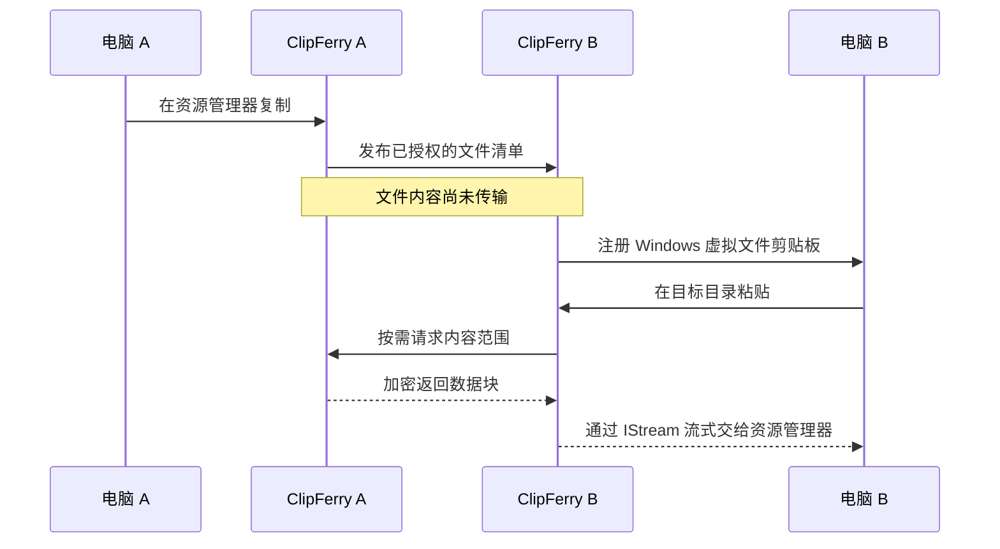

<p align="center">
  
</p>

<h1 align="center">ClipFerry</h1>

<p align="center">
  <strong>剪贴摆渡：在一台 Windows 电脑复制，在另一台直接粘贴。</strong><br>
  轻量、便捷、无声无息。
</p>

<p align="center">
  <a href="./README.md">English</a> · <strong>简体中文</strong>
</p>

<p align="center">
  <a href="#为什么是-clipferry">为什么是 ClipFerry</a> ·
  <a href="#开始使用">开始使用</a> ·
  <a href="#日常使用">日常使用</a> ·
  <a href="#安全与隐私">安全与隐私</a> ·
  <a href="#支持项目">支持项目</a>
</p>

<p align="center">
  
  
  
  
</p>

## 为什么是 ClipFerry

同时使用两台电脑时，移动文件不应该变成一项额外工作。键盘和鼠标可以借助 Microsoft PowerToys 的 Mouse Without Borders 在机器之间移动，但它内置的文件复制只支持单个文件，并且有 100 MB 上限。文件夹、多文件和大文件仍然需要换一种传输方式。

ClipFerry 只专注于把这件事做好：

1. 在电脑 A 的资源管理器中选中文件或文件夹，按 `Ctrl+C`。
2. 把鼠标移到电脑 B，在目标目录按 `Ctrl+V`。
3. ClipFerry 在后台通过局域网传输内容，Windows 资源管理器照常显示复制进度。

不需要把文件先传到云端，不需要打开独立的文件管理器，也不用改变已经形成肌肉记忆的复制粘贴方式。

### 轻量

- 一个原生 Windows EXE，不捆绑 Electron、WebView、数据库或独立运行时。
- 0.1.4 的 Release 构建约 2.8 MiB，可直接放在任意目录运行。
- 文件内容采用有界内存的流式传输，不会为了发送大文件先把整个文件读进内存。

### 便捷

- 两台电脑各运行一次，局域网自动发现，首次双端确认后保存可信设备。
- 直接使用资源管理器的 `Ctrl+C` 和 `Ctrl+V`，不拦截全局快捷键。
- 支持单文件、多文件和文件夹双向复制。
- 支持查看进度、暂停、继续与取消接收任务。

### 无声无息

- 正常使用时只驻留在系统托盘，不抢焦点，不保留多余主窗口。
- 复制时只同步文件清单；真正按下 `Ctrl+V` 后才传输文件内容。
- 支持随 Windows 登录自动启动，需要时出现，平时安静待在后台。

## 开始使用

### 1. 准备两台电脑

- 系统：Windows 10 或 Windows 11，x64。
- 网络：两台电脑连接同一个可信的局域网，建议将该 Windows 网络配置为“专用网络”。
- 程序：两台电脑使用同一版本的 `clipferry.exe`。

ClipFerry 负责文件剪贴板。要让键盘和鼠标在两台电脑之间移动，请在两台电脑上安装 [Microsoft PowerToys](https://learn.microsoft.com/windows/powertoys/install)，并启用其中的 [Mouse Without Borders](https://learn.microsoft.com/windows/powertoys/mouse-without-borders)。

### 2. 配置 Mouse Without Borders

1. 在两台电脑上打开 PowerToys 设置，启用 **Mouse Without Borders**。
2. 在第一台电脑生成安全密钥，在第二台填写第一台的安全密钥和设备名称并连接。
3. 在 PowerToys 中拖动设备卡片，使排列方向与两台真实屏幕一致。
4. 建议在两台电脑上关闭 Mouse Without Borders 的 **Share clipboard** 和 **Transfer file**。这样由 Mouse Without Borders 负责键盘和鼠标，由 ClipFerry 独占 Windows 文件剪贴板，避免两个程序互相覆盖。
5. 如果连接失败，先确认两台电脑位于同一网络，再按微软文档检查防火墙并使用 **Refresh connections**。

> Mouse Without Borders 属于 Microsoft PowerToys。它的安装、权限、安全密钥和连接问题请以微软官方文档为准。

### 3. 启动 ClipFerry

1. 将 `clipferry.exe` 分别复制到两台电脑。无需安装，也不需要管理员权限。
2. 在两台电脑上双击 `clipferry.exe`。
3. 第一次启动时，如果 Windows 防火墙询问是否允许通信，请只允许可信的“专用网络”。
4. 在任务栏通知区域找到 ClipFerry 图标；Windows 可能会把它收进 `^` 展开的隐藏图标中。

### 4. 完成首次配对

1. 确认两台电脑上的 ClipFerry 都已启动，并等待几秒钟完成局域网发现。
2. 在任意一台电脑右键托盘图标，选择 **配对新设备…**。
3. 在发现列表中确认对方的设备名称和地址。
4. 两台电脑都会显示验证码和设备指纹。只有两边验证码完全一致时才允许配对。
5. 双端都确认后，ClipFerry 会保存可信设备和当前局域网连接地址，并默认开启自动接收。
6. 双击托盘图标或选择 **查看状态**，确认对端已经在线。

首次配对成功后，日常启动不需要再次配对。

## 日常使用

### 从电脑 A 复制到电脑 B

1. 在电脑 A 的资源管理器中选中一个或多个文件、文件夹。
2. 按 `Ctrl+C`。
3. 使用 Mouse Without Borders 把键盘和鼠标移到电脑 B。
4. 在电脑 B 打开目标目录，按 `Ctrl+V`。
5. 等待 Windows 资源管理器完成复制。传输期间请保持电脑 A 开机、联网，并确保源文件仍然可读。

从电脑 B 复制回电脑 A 的步骤完全相同。

### 托盘菜单

| 菜单项 | 用途 |
| --- | --- |
| 查看状态 | 查看本机身份、可信设备、连接、最近清单和传输状态 |
| 配对新设备… | 自动发现并与另一台 ClipFerry 电脑首次配对 |
| 管理已配对设备… | 查看可信设备或取消配对 |
| 高级连接设置… | 自动配置不适合特殊网络时，手动选择设备和地址 |
| 接收待确认的文件剪贴板 | 自动接收关闭时，手动接收对端发来的清单 |
| 显示传输窗口 | 查看文件数量、字节进度、速度和当前状态 |
| 暂停 / 继续 / 取消传输 | 控制当前接收任务 |
| 随 Windows 启动 | 切换当前用户登录后的自动启动 |
| 打开诊断日志 | 排查发现、连接或传输问题 |
| 退出 ClipFerry | 安全停止 ClipFerry |

## 它是怎样工作的



ClipFerry 使用 Windows Shell 虚拟文件剪贴板。接收端通过 `IDataObject` 暴露 `FILEGROUPDESCRIPTORW` 和 `FILECONTENTS`，由 `IStream` 在资源管理器真正读取时按需提供数据。网络层支持范围读取、Seek、短读和重试，因此无需预先创建一份完整的临时副本。

## 安全与隐私

- 只在局域网内工作，不上传云端，也没有公网中转服务。
- 首次配对必须核对双端验证码并分别确认。
- 每台电脑都有持久身份和 SHA-256 指纹。
- 文件通道使用证书固定和 TLS 1.3 双向认证。
- 对端只能读取当前文件清单明确授权的内容，不能请求任意本地路径。
- 文件名会再次校验，拒绝路径穿越、UNC、设备名和 NTFS ADS 等危险形式。
- 配对密钥和传输能力凭据不会写入普通诊断日志。

请只在自己信任的电脑和网络上配对。若不再信任某台设备，请从 **管理已配对设备…** 中取消配对。

## 常见问题

### 托盘里找不到另一台电脑

确认两台电脑都已启动 ClipFerry、连接同一局域网，并在 Windows 防火墙中允许 ClipFerry 使用专用网络。等待几秒后再次选择 **配对新设备…**。

### 已配对，但状态不是在线

确认对方仍处于唤醒状态并运行着 ClipFerry。普通家庭网络会自动刷新已发现设备的当前地址；如果机器存在 VPN、多个虚拟网卡或特殊路由，再在检查自动配置后使用 **高级连接设置…**。

### 复制后，另一台电脑没有得到文件剪贴板

打开 **查看状态**，确认活动设备在线并且自动接收已开启。如果自动接收被关闭，可选择 **接收待确认的文件剪贴板**。

### PowerToys 弹出了自己的文件传输提示

在两台电脑的 Mouse Without Borders 设置中关闭 **Share clipboard** 和 **Transfer file**。ClipFerry 负责文件剪贴板，Mouse Without Borders 只负责键盘和鼠标。

### 无法与管理员应用交互

这由 Mouse Without Borders 的运行权限决定，与 ClipFerry 文件传输无关。微软文档提供了管理员模式和服务模式；启用服务模式前请同时阅读微软给出的安全风险提示。

## 从源码构建

需要 Rust stable、Visual Studio 2022 C++ 构建工具和 Windows 10/11 SDK。

```powershell
cargo fmt --all -- --check
cargo clippy --all-targets --all-features -- -D warnings
cargo test
cargo build --release
```

Release 输出位置：

```text
target\x86_64-pc-windows-msvc\release\clipferry.exe
```

## 关于作者

ClipFerry 由 **micky-meecky** 开发和维护。它源于一个很直接的愿望：充分利用两台 Windows 电脑，又不想为了传文件引入沉重的远程桌面软件、投屏或云端中转。Mouse Without Borders 很好地解决了键盘和鼠标移动，但文件传输上限留下了缺口。于是有了这个专注于 Windows 文件剪贴板的小型原生工具。

## 支持项目

如果 ClipFerry 让你的双机文件流转轻松了一点，欢迎通过支付宝或微信支付支持后续开发。

<table align="center">
  <tr>
    <th align="center">支付宝</th>
    <th align="center">微信支付</th>
  </tr>
  <tr>
    <td align="center"></td>
    <td align="center"></td>
  </tr>
</table>

感谢你的使用、分享或支持。

## 许可证

ClipFerry 使用 [GNU General Public License v3.0](./LICENSE)，对应 SPDX 标识 `GPL-3.0-only`。你可以使用、研究、修改和分发本项目；分发本项目或其衍生版本时，需要按照 GPLv3 提供相应源代码并保留同等许可与声明。

---

<p align="center">
  <br>
  <sub>复制清单，粘贴启航。</sub>
</p>
